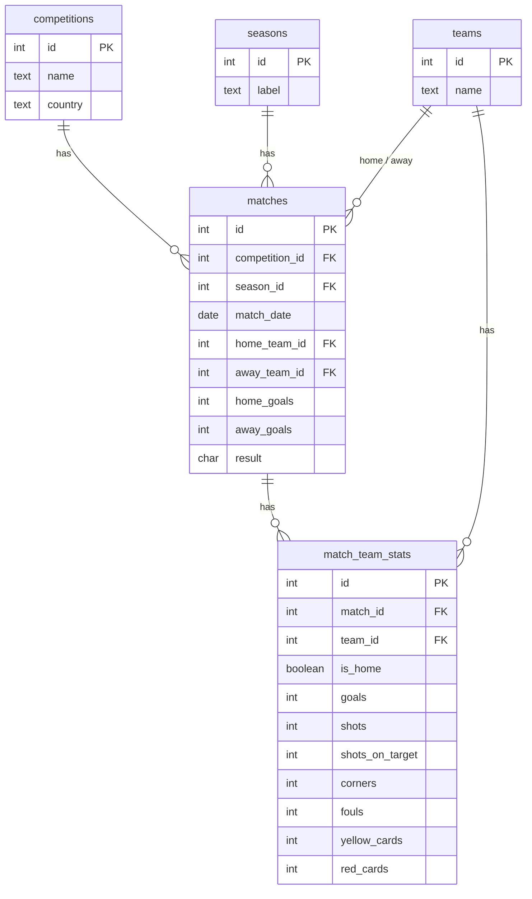

# ⚽ Football Analytics — SQL Project

A relational database and analytical query library built on **real Premier League
data** (5 seasons, ~1,900 matches). The project designs a normalised PostgreSQL
schema, ingests raw match CSVs with a Python pipeline, and answers football
questions with SQL — from simple lookups up to window functions.

Built as a portfolio project to demonstrate end-to-end data skills: **data
modelling → ingestion (ETL) → analysis**.

---

## 🛠️ Tech stack

| Tool | Purpose |
|------|---------|
| **PostgreSQL 16** | Relational database |
| **Python** (pandas, SQLAlchemy, psycopg2) | ETL pipeline: CSV → database |
| **SQL** | Analytical queries |
| **DBeaver** | Database client / query workbench |

## 📊 Data

Source: [football-data.co.uk](https://www.football-data.co.uk/) — free public
match data (results plus per-match stats: shots, shots on target, corners,
fouls, cards). Five Premier League seasons, 2019/20 → 2023/24.

## 🗺️ Database schema

Normalised into five tables — every real-world entity (team, competition,
season) is stored once and referenced by foreign key. Per-match stats are held
"tall" (one row per team per match), which makes per-team aggregation a clean
`GROUP BY`.



## 🧠 SQL concepts demonstrated

The query library ([`sql/queries.sql`](sql/queries.sql)) builds up in difficulty:

| Query | Concepts |
|-------|----------|
| Q1 | `SELECT`, `ORDER BY`, `LIMIT`, arithmetic in `ORDER BY` |
| Q2 | `JOIN`, table & column aliases, self-referential join (home/away) |
| Q3 | Aggregation — `SUM`, `GROUP BY` |
| Q4 | `HAVING` (filtering groups vs `WHERE` filtering rows) |
| Q5 | Self-join (opponent lookup for goals conceded) |
| Q6 | `CASE` expressions — full league table rebuilt from raw data |
| Q7 | CTE (`WITH`) + window function (`RANK() OVER`) |

## 📈 Key findings

A few results the query library surfaces (all figures computed from the raw
data — 1,900 matches, 2019/20 → 2023/24):

**Q7 — the 2023/24 Premier League table, rebuilt from raw match rows.** The
`CASE` + window-function query reproduces the real final table exactly:

| Pos | Team | Pld | Pts | GF | GA | GD |
|----:|------|----:|----:|---:|---:|---:|
| 1 | Man City | 38 | 91 | 96 | 34 | +62 |
| 2 | Arsenal | 38 | 89 | 91 | 29 | +62 |
| 3 | Liverpool | 38 | 82 | 86 | 41 | +45 |
| … | | | | | | |
| 20 | Sheffield United | 38 | 16 | 35 | 104 | −69 |

**Q1 — highest-scoring matches (2023/24).** Chelsea 4–4 Man City and Newcastle
4–4 Luton top the list, but the standout scoreline is **Sheffield United 0–8
Newcastle** — the same defence that shipped 104 goals across the season.

**League-wide, across all five seasons:** home advantage is real but modest —
**44.1%** of matches are home wins, **33.2%** away wins, **22.7%** draws, at an
average of **2.87 goals per match**.

## 🚀 Running it yourself

**Prerequisites:** PostgreSQL 16, Python 3, and the Python packages
(`pip install pandas sqlalchemy psycopg2-binary`).

```bash
# 0. Tell the tools your PostgreSQL password via an environment variable
#    (PowerShell example — never hardcode secrets in the code):
#    $env:PGPASSWORD = "yourpassword"

# 1. Create the database
psql -U postgres -c "CREATE DATABASE football;"

# 2. Build the schema (tables, keys, indexes)
psql -U postgres -d football -f sql/schema.sql

# 3. Load the data (downloads + ingests 5 seasons)
python load_data.py
```

Then open `sql/queries.sql` in DBeaver (or run with `psql`) and explore.

> The code reads the DB password from the `PGPASSWORD` environment variable, so
> no credentials live in the repo.

## 📁 Project structure

```
football-sql/
├── README.md
├── load_data.py        # ETL: downloads CSVs and loads them into PostgreSQL
├── data/               # raw season CSVs (one per season)
└── sql/
    ├── schema.sql      # table definitions, keys, constraints, indexes
    └── queries.sql     # the analytical query library (Q1–Q7)
```
